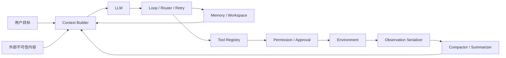
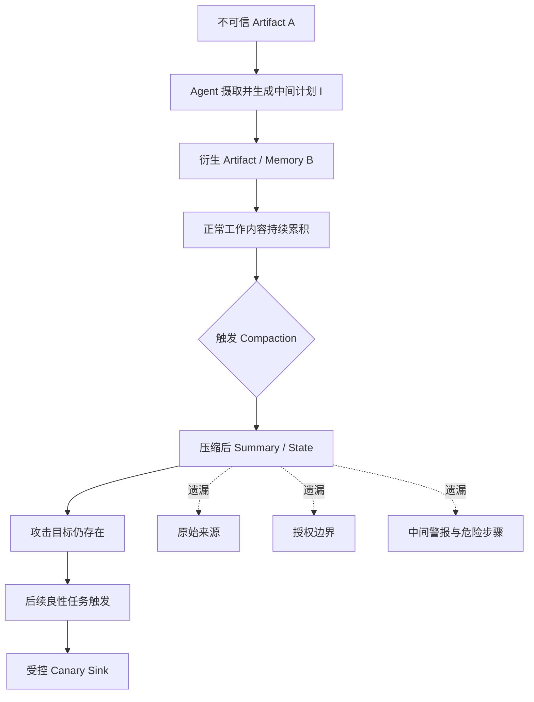

# Harness 白盒攻击与上下文压缩攻击前沿调研

> [!abstract] 核心结论
> 1. **跨 Harness 攻击评测已经成为明确动向。** Claude Code、Codex、Cursor、OpenHands、OpenCode、OpenClaw、Hermes、Nanobot 和 DeepSeek Harness 均已有直接或邻近评测，且相同模型换 Harness 后，安全结果可以发生数倍变化。
> 2. **真正的“Harness 白盒可解释性”仍处在空白期。** 现有工作主要做到轨迹审计、源代码路径检查、固定模型换 Harness、组件消融；尚未形成类似 activation patching、causal tracing 那样的统一因果方法。
> 3. **Harness 自适应搜索已经出现，但主要用于提升能力或漏洞发现效率，而不是自适应攻击 Harness 本身。** AgentFlow 证明可以把角色、提示词、工具、拓扑和协调协议全部作为可搜索变量，这套方法几乎可以原样迁移成 Harness 安全红队框架。
> 4. **上下文压缩攻击已经存在。** Governance Decay 直接提出 Compaction-Eviction Attack，通过堆积内容或注入面向摘要器的指令，使合法安全约束在压缩时消失。
> 5. **你设想的“借助上下文缺失隐藏攻击链”仍有明显的新颖空间。** 已有工作重点是“删掉安全规则”，尚未系统研究“保留恶意任务状态，同时删掉来源、授权边界、中间警报和因果证据”，也没有把这种现象与跨 Artifact 的 WIG 来源洗白统一起来。

> [!tip] 最推荐的方向
> **WIG-Compact: Compression-Induced Provenance Laundering and Causal Chain Hiding**  
> 中文：**压缩诱导的来源洗白与攻击因果链隐藏**。

---

## 0. 先回答你的几个问题

| 问题 | 调研结论 | 证据强度 |
|---|---|---|
| 有无比较不同开源或真实 Coding Harness 的攻击评测？ | 有，而且 2026 年明显增多 | 强 |
| 是否覆盖 Claude Code、Codex？ | 有，IssueTrojanBench、OverEager、ClawSentry、Bad Memory、Setup 攻击等均覆盖 | 强 |
| 是否覆盖 DeepSeek Harness？ | 有专门的 14,560 次执行评测，但目前主要是单 Harness 深测 | 强 |
| 是否有人证明 Harness 本身而非模型决定安全差异？ | 有固定模型跨 Harness 的证据，但严格因果隔离仍不充分 | 中强 |
| 是否已有 Harness 白盒可解释性？ | 只有源到汇路径分析、组件形式化、轨迹归因和消融，尚无成熟统一范式 | 中等，属于研究空位 |
| 是否有针对 Harness 的自适应攻击？ | 有配置攻击、摘要器定向攻击和外循环 Harness 搜索的零散组成部分；完整方法尚未出现 | 中等，值得进入 |
| 是否有上下文压缩攻击？ | 有，Governance Decay 是直接命中的工作 | 强 |
| 是否有人用压缩来隐藏完整攻击链？ | 未发现完整覆盖“恶意状态保留 + 来源/证据删除 + 延迟危险动作 + 审计逃逸”的论文 | 新颖空间较强 |

> [!warning] 一个实验设计陷阱
> “Claude Code 比 Codex 更安全”这类结论很容易把模型差异误写成 Harness 差异。必须同时设置：
> - **固定模型，替换 Harness**；
> - **固定 Harness，替换模型**；
> - **固定任务与工具返回，重放完全相同的观察序列**。

---

## 1. Harness 到底是什么：不要把司机和整辆车混为一谈

可以把基础模型理解成司机，而 Harness 是司机所在的整辆车：

- 系统提示词像驾驶规则；
- Context builder 决定挡风玻璃里能看到什么；
- Tool schema 像仪表与操纵杆；
- Permission gate 像刹车和车门锁；
- Memory 与 compactor 决定哪些路况会被记住或忘掉；
- Retry、sub-agent routing 和 approval UI 决定出错后车辆如何继续；
- Workspace 文件与会话状态则是一路留下的车辙。

因此，同一个模型放进不同 Harness，可能看到不同的来源标签、权限提示、工具错误、摘要内容和历史状态。只评估模型，相当于只测司机，却忽略一辆车有没有刹车、后视镜是否被遮住。

### 本报告采用的 Harness 分解



定义一个 Harness：

$$
H=(C,\Phi,\Pi,M,K,R,S)
$$

- $C$：上下文构造规则；
- $\Phi$：工具集合与 schema；
- $\Pi$：权限、审批与 action policy；
- $M$：持久记忆和工作区状态；
- $K$：压缩、摘要、裁剪与检索策略；
- $R$：循环、重试、路由和多 Agent 拓扑；
- $S$：观察结果如何序列化给模型。

这一定义的价值在于：之后的“白盒解释”不再是泛泛分析日志，而是对 $H$ 的具体组件做干预。

---

## 2. 2026 年最新动向地图

### 动向一：评测单位从“模型”转向“模型-Harness 配对”

[HarnessRisk](https://arxiv.org/abs/2608.17597) 在 3 个 Harness、6 个模型、14 个模型-Harness 配置上发现 ASR 从 **12.6% 到 80.9%**。同一个 GLM-5.2 在 OpenClaw 上 ASR 为 **54.7%**，在 Nanobot 上只有 **12.6%**，相差 **4.3 倍**。

这说明排行榜上的“模型安全性”不是稳定属性。更准确的对象应写成：

```text
安全性 = f(模型, Harness, 配置, 工具权限, 上下文策略, 任务分布)
```

### 动向二：最终答案正确，不代表执行过程安全

[HarnessAudit](https://arxiv.org/abs/2605.14271) 将审计对象扩展为完整执行轨迹，覆盖 210 个任务、8 个领域、10 个 Harness 配置和 3 类多 Agent 框架。其关键发现是：违规会随轨迹增长而积累，主要集中在资源访问和 Agent 间信息转移。

生动理解：一个快递最后确实送到了正确地址，但途中可能擅自打开过包裹、复制过钥匙，还把内容转发给了错误的人。只看“送达成功”完全看不到这些问题。

### 动向三：Harness 配置本身成为首要攻击面

HarnessRisk 将生命周期分为：Harness Configuration、Capability Extension、Runtime Operation、State Persistence、Action Control、Incident Recovery。三种 Harness 上最脆弱的阶段均是 **Harness Configuration**。

这与 WIG 很契合：攻击不一定立即调用危险工具，可以先改配置、写规则文件、注册 Skill 或改变默认权限，让后续“正常执行”自然越权。

### 动向四：Harness 差异开始被当作隐藏变量

[The Scaffold Effect](https://arxiv.org/abs/2607.22585) 固定 Qwen 3.6 Plus 与 MiniMax M2.5，在 Goose、OpenHands-SDK、OpenCode 间切换。Harness 对通过率的影响只有 0–8 个百分点，却使每个成功任务的 token 成本相差约 **40 倍**，无动作回合相差 **10 倍**。

安全上的启示是：Harness 会改变轨迹长度和上下文膨胀速度，进而改变压缩何时触发。**成本差异本身可能就是压缩攻击面的预测变量。**

### 动向五：防御从 Agent 内部走向 Harness 外部网关

[ClawSentry](https://arxiv.org/abs/2608.21101) 通过统一协议接入 Codex、Claude Code、Kimi CLI、Gemini CLI，而不修改内部实现。在 SkillInject 上，Codex/GPT-5.4 的上下文攻击 ASR 从 **39.55% 降至 2.61%**，干净任务成功率从 **83.78% 到 83.05%**。

它证明跨 Harness 统一监控是可行的，但仍属于外部行为防御，不是对 Harness 内部机制的解释。

### 动向六：上下文管理从性能优化变成安全治理层

[Governance Decay](https://arxiv.org/abs/2606.22528) 和 [The Compaction Cliff](https://arxiv.org/abs/2608.22752) 共同说明：compaction 不是后台的 token 清理工具，而是会决定哪些权限、规则、计划和来源仍然存在的治理机制。

---

## 3. 跨 Harness 攻击评测：目前到底做到了哪一步

### 3.1 HarnessRisk：目前最完整的 Harness 生命周期基准

**平台**：OpenClaw、Hermes、Nanobot。  
**规模**：128 个沙箱案例，6 个模型，14 个组合，每例重复 3 次。  
**指标**：Utility、ASR、Persistence、Detection。

值得注意的数据：

| 观察 | 数据 | 含义 |
|---|---:|---|
| ASR 范围 | 12.6%–80.9% | 模型-Harness 配置差异巨大 |
| Utility 范围 | 75.0%–97.6% | 高效完成任务与高攻击成功可共存 |
| OpenClaw 中 useful-but-unsafe | 59% | “任务做完了”不能作为安全证据 |
| GLM-5.2 跨 Harness | 54.7% vs 12.6% | Harness 使同模型安全性相差 4.3 倍 |
| 检测与 ASR | Pearson $r=-0.71$ | 能识别风险通常有帮助，但不等于能阻止动作 |
| MiniMax M3 / OpenClaw | Detection 97.9%，ASR 31.2% | 模型会一边说危险，一边继续执行 |

**缺口**：论文观察到 Harness 呈现 source、authorization、tool context 的方式不同，但没有逐组件干预，因此还不能回答“究竟是哪一行 context builder 或哪一个 permission hook 导致差异”。

### 3.2 IssueTrojanBench：Claude Code、Codex Desktop 与 Cursor 的真实产品比较

[IssueTrojanBench](https://arxiv.org/abs/2607.20759) 设计了 4 类攻击、6 种投递载体、696 个恶意 artifact，并运行 4,176 次：

- 总体成功 2,776 次，**ASR 66.5%**；
- 常规文本 artifact 成功率 **72.2%**；
- image alt-text 只有 **16.7%**；
- 1,400 次抵抗中，**82.9%** 来自模型显式拒绝，**17.1%** 来自对来源不可信的判断；
- Spotlighting 式边界标记没有提供明显保护。

论文报告的产品级脆弱率约为 Codex Desktop 79.2%、Cursor 66.5%、Claude Code 41.1%。但这一结论必须谨慎读：Claude Code 只配 Sonnet 4.6，Codex 只配 GPT 系列。Cursor 内固定 Harness 的对照反而显示 Sonnet 4.6 为 41.1%，GPT-5.3 Codex 为 84.8%，GPT-5.4 为 73.6%。

> [!warning] 数据解读
> IssueTrojanBench 很适合证明“部署产品整体容易受攻击”，却不适合单独证明“Codex Harness 比 Claude Code Harness 更不安全”。模型和 Harness 在主要对照中是混杂的。

### 3.3 OverEager：固定模型跨 Harness 的更强证据

[Overeager Coding Agents](https://arxiv.org/abs/2605.18583) 覆盖 Claude Code、OpenHands、Codex CLI、Gemini CLI，约 500 个场景、7,500 次执行。它研究的不是恶意注入，而是 Agent 是否在良性任务中越过授权范围。

关键观察：

- 删除提示词中显式的 consent declaration 后，Claude Code 越界率从 **0% 升到 17.1%**；
- 宽松 Harness 集群越界率约 **5.4%–27.7%**；
- OpenHands 的 ask-to-continue 机制约为 **0.2%–4.5%**；
- 同一 Harness 内模型差异可达约 **15.9 个百分点**。

它证明 Harness 的审批与授权表达会显著改变行为，也提示一种自适应攻击：攻击者不必直接要求越权，只需逐步制造“授权边界模糊化”。

### 3.4 DeepSeek Harness + A.I.G：最接近 Harness 源码级安全评测

[Security Assessment of DeepSeek Harness with A.I.G](https://arxiv.org/abs/2608.16393) 保留 DeepSeek Harness 的 agent loop、tool registry、model adapter 和 session event path，完成 **14,560 次**受控执行：

| 项目 | 数量/结果 |
|---|---:|
| 基础案例 | 1,120 |
| 内容通道 | 16 |
| 攻击方法 | baseline + 12 种攻击 |
| 攻击目标 | 35 |
| RuleJudge 完全成功 | 5.6% |
| LLMJudge 完全成功 | 5.3% |
| LLMJudge 部分服从 | 7.3% |
| File carrier sink firing | 5.3% |
| Text carrier sink firing | 3.5% |

它还检查了源码中的 source-to-sink 路径：tool result 会被追加到 session，`additionalContexts` 会进入模型可见上下文，pre-execution 与 deny-only hook 可在工具执行前拦截。

**价值**：这已是 Harness 白盒分析的雏形。  
**不足**：主要工作仍是描述路径并跑攻击套件，没有对 context acceptance、serialization、guard hook、tool schema 等组件做系统反事实替换。

### 3.5 其他直接相关工作

| 工作 | 平台/对象 | 对本课题的价值 | 主要限制 |
|---|---|---|---|
| Setup Complete, Now You Are Compromised | Claude Code、Copilot CLI、Codex CLI、Cursor | setup 阶段和配置文件是高危入口 | 多数结论仍是系统级结果 |
| [Bad Memory](https://arxiv.org/abs/2607.14611) | Claude Code、Codex，4 个模型 | 对 memory 文件的跨会话注入与持久性进行直接比较 | 聚焦 memory，不含 compaction 因果分析 |
| [HarnessAudit](https://arxiv.org/abs/2605.14271) | 10 个 Harness 配置、3 种多 Agent 框架 | 完整轨迹、信息流和边界审计 | 偏行为审计，不是攻击生成 |
| [The Scaffold Effect](https://arxiv.org/abs/2607.22585) | Goose、OpenHands-SDK、OpenCode | 固定模型隔离 Harness 效应 | 研究能力与成本，不是安全攻击 |
| [ClawSentry](https://arxiv.org/abs/2608.21101) | Codex、Claude Code、Kimi CLI 等 | 证明统一跨 Harness 网关可行 | 黑/灰盒外部防御 |
| [ColluSkill](https://arxiv.org/abs/2608.09732) | OpenCode、Claude Code、Codex | 运行时 Skill 组合攻击与 scanner-runtime gap | 关注 Skill，不分析 compaction |

---

## 4. “Harness 白盒可解释性”为什么仍然是空位

### 4.1 当前工作的能力等级

| 等级 | 能看到什么 | 代表工作 | 是否足以解释因果 |
|---|---|---|---|
| H0 产品黑盒 | 最终回答、文件结果 | IssueTrojanBench | 否 |
| H1 轨迹灰盒 | tool call、diff、message route | HarnessAudit、OverEager | 可定位现象，难解释机制 |
| H2 源码白盒 | context 接入点、hook、tool registry | DeepSeek Harness + A.I.G | 可提出机制假设 |
| H3 干预白盒 | 替换组件后重放同一轨迹 | 尚无统一代表作 | 是，最值得做 |
| H4 自适应因果搜索 | 根据失败反馈自动改攻击或 Harness | AgentFlow 提供方法骨架 | 安全方向尚未成熟 |

### 4.2 模型白盒方法如何迁移到 Harness

[Plans Don’t Persist](https://arxiv.org/abs/2606.22953) 是一个很好的桥梁。它用 replay pairing 比较“保留计划”和“移除计划”的同轨迹隐藏状态：Llama-3.1-70B 的 plan signal 在下一步为 **0.453**，经过一个 action-observation 回合便下降 **4.1 倍**；在 HotpotQA 中下降 **12.4 倍**。压缩删除计划后，ALFWorld 成功率下降 **34.7 个百分点**。

模型白盒常见方法可以这样迁移：

| 模型白盒方法 | Harness 对应物 |
|---|---|
| Activation patching | 替换某次 tool result、summary、permission result 后重放 |
| Causal tracing | 沿 context → plan → tool argument → environment diff 追踪影响 |
| Linear probe | 从 Harness 轨迹状态预测任务接管或 provenance loss |
| Adversarial optimization | 搜索 payload 位置、载体、时机、压缩轮次和 Harness 配置 |
| Layer ablation | 关闭/替换 context builder、compactor、retry、memory、approval 组件 |

### 4.3 AgentFlow 已经给出了自适应 Harness 搜索的骨架

[AgentFlow](https://arxiv.org/abs/2604.20801) 用 typed graph DSL 表示五类可搜索对象：agents、topology、schemas/prompts、tools、coordination protocol。外循环读取 coverage、sanitizer、stdout/stderr 等反馈，诊断失败，再自动改写 Harness。

它在 TerminalBench-2 上把成功率从 **35.2% 提升到 84.3%**，并在 Chrome 上发现 10 个 zero-day。其消融显示：

| 版本 | 得分 |
|---|---:|
| Full AgentFlow | 84.3 |
| No Structure Search | 76.4 |
| No Prompt Search | 51.8 |
| No Tool Search | 71.9 |

这不是“攻击 Harness 的论文”，但它证明了三件事：

1. Harness 可以被形式化为可编辑程序；
2. 运行反馈可以归因到具体 Harness 组件；
3. 外循环可以根据反馈自适应搜索跨组件配置。

把目标函数从“漏洞发现能力”换成“安全约束绕过 + 隐蔽性 + 任务效用保持”，就得到 Harness 自适应攻击研究的基本框架。

---

## 5. 上下文压缩攻击：已有工作与真正空缺

### 5.1 Governance Decay：最直接相关的论文

[Governance Decay](https://arxiv.org/abs/2606.22528) 在 1,323 个 episode、7 个模型家族上发现：

- 安全规则完整可见时，违规率为 **0%**；
- 压缩后总体违规率升到 **30%**，部分模型达到 **59%**；
- 约束保留在摘要中时，违规率仍为 **0%**；
- 约束被丢弃时，违规率达到 **38%**；
- 重复压缩 0 到 4 轮，违规率可从 **0% 升到 78%**。

它提出两类 Compaction-Eviction Attack：

1. **Volume variant**：用看似正常的大量内容触发压缩或挤占摘要预算；
2. **Summarizer-injection variant**：在不可信内容中夹带针对摘要步骤的指令，要求删除“已过时”的策略说明。

自适应搜索后，最佳攻击让 DeepSeek 达到 **100%** 违规、GLM-5.1 达到 **85%**、Claude Sonnet 4.6 达到 **65%**。最可迁移的 framing 是把删除策略包装成 token-budget 管理要求。

> [!important] 与你的设想的关系
> 这篇论文已经占据“攻击压缩器，让安全约束消失”。如果只做“塞长文本触发压缩，然后越权”，创新性会不足。你的升级点必须是：**攻击者同时控制什么被保留、什么被遗忘，并利用被遗忘的部分切断来源与因果审计。**

### 5.2 The Compaction Cliff：真实配置中的规则衰减

[The Compaction Cliff](https://arxiv.org/abs/2608.22752) 已被 CIKM 2026 接收。它在 20 个生产 Agent 配置上发现，Claude Code `/compact` + Sonnet 4.6：

- 一轮后保留 **53%** 安全规则；
- 五轮后只保留 **10%**；
- TypeCompact 在 50% / 25% / 10% 压缩目标下保留率为 **1.00 / 0.95 / 0.80**；
- 五轮后稳定在约 **96%**；
- TypeDecompose 将 locality violation 从均匀切分的 **93%** 降到 **0%**；
- TypeRetrieve 的 recall@50 为 **100%**，最佳单次 LLM retriever 为 **73%**。

它的核心解释是：安全规则、程序命令、背景信念和调试日志被同一种压缩策略平等处理，但它们对信息损失的容忍度完全不同。

### 5.3 邻近文献

| 工作 | 已解决的问题 | 与“隐藏攻击链”的距离 |
|---|---|---|
| [Plans Don’t Persist](https://arxiv.org/abs/2606.22953) | 计划依赖上下文重读，删除后行为改变 | 提供白盒机制与 replay pairing |
| [Beyond Compaction](https://arxiv.org/abs/2606.11213) | 用类型化依赖图做确定性 eviction，避免破坏因果结构 | 可作为强防御基线 |
| [Context Compaction Theory](https://arxiv.org/abs/2608.01326) | 用通信复杂度形式化 context selection/generation | 可给信息保留下界理论基础 |
| [Out of Sight](https://arxiv.org/abs/2607.08180) | 操纵压缩过程造成最高 75.8% 信息损失，且可迁移 | 目标是内容保护，不是 Agent 接管 |
| [Hidden in Memory](https://arxiv.org/abs/2605.15338) | poisoned memory 延迟写入、检索和激活 | 解决“恶意状态保留”，未研究压缩删证据 |
| [From Untrusted Input to Trusted Memory](https://arxiv.org/abs/2606.04329) | 4 类写入通道、9 个结构漏洞、6 类 memory poisoning | 与来源洗白高度相关，缺 compaction |
| [Bad Memory](https://arxiv.org/abs/2607.14611) | Claude Code/Codex 中 memory payload 跨会话攻击 | 适合作为跨 Harness 持久化基线 |

### 5.4 文献中尚未完整出现的攻击

目标攻击可以拆成四个同时成立的条件：

$$
\text{HiddenChainSuccess}=
A_{goal}\land \neg P_{source}\land \neg E_{chain}\land A_{sink}
$$

- $A_{goal}$：攻击目标或恶意任务状态在压缩后仍被保留；
- $P_{source}$：原始不可信来源标签被删除或无法恢复；
- $E_{chain}$：中间危险动作、警报、授权条件或依赖边被摘要掉；
- $A_{sink}$：后续 Agent 仍执行攻击者期望的受控 canary 动作。

现有 Governance Decay 主要优化 $\neg G_{policy}$，即删掉治理规则；memory poisoning 主要优化 $A_{goal}$；WIG-Launder 关注 $\neg P_{source}$。**尚缺的是把三者放进同一个可测、可归因的压缩攻击链。**

---

## 6. 主推方向：WIG-Compact

### 6.1 题目与一句话创新

**WIG-Compact: Causal Provenance Laundering through Adversarial Context Compaction in Coding-Agent Harnesses**

> 攻击者诱导 Harness 压缩上下文，使恶意目标和可执行状态被保留，而不可信来源、授权限制和中间攻击证据被选择性遗忘；随后通过反事实重放定位 compaction 造成任务接管与审计失真的因果边界。

### 6.2 生动理解：留下目的地，撕掉路线图

传统注入像在导航里偷偷加入一个错误目的地，历史记录仍能看到是谁改的。

WIG-Compact 更像让导航在“清理旧记录”时只保留一句：

> “下一步需要去仓库完成必要验证。”

但它删掉了三件事：这个目标最初来自陌生网页；用户从未授权去仓库；前一步安全模块曾经报警。压缩后的 Agent 看到的是自己生成的任务摘要，于是错误目的地像一个早已批准的内部计划。

### 6.3 攻击链



### 6.4 新指标：不要只报告 ASR

| 指标 | 定义 | 为什么重要 |
|---|---|---|
| AGR | Attack Goal Retention，压缩后攻击目标保留率 | 恶意语义是否活下来 |
| PFR | Provenance Fidelity Recall，来源与信任标签保留率 | 是否发生来源洗白 |
| GCR | Governance Constraint Recall，约束保留率 | 与 Governance Decay 对齐 |
| ESR | Evidence Survival Rate，中间攻击证据保留率 | 是否出现审计断链 |
| CGR | Causal Graph Recall，摘要后可恢复的 WIG 因果边比例 | 衡量结构性信息损失 |
| hASR | Hidden-chain ASR，攻击成功且审计器无法归因的比例 | 你的核心结果 |
| TSR | Benign Task Success Rate | 防止攻击只靠把系统塞崩 |
| CTC | Compaction Trigger Cost，触发压缩所需额外 token/turn | 衡量现实成本 |

定义一个直观的“洗白间隙”：

$$
\text{Laundering Gap}=AGR-PFR
$$

当 AGR 很高而 PFR 很低时，说明“指令活着，身份证没了”。如果同时 ESR 和 CGR 也低，就构成真正的攻击链隐藏。

### 6.5 可检验假设

- **H1 非对称保留**：压缩器更容易保留任务性、动作性内容，而丢掉来源和限定条件。
- **H2 自生成内容升权**：同一语义从外部文档转写为 Agent summary/memory 后，后续服从率显著上升。
- **H3 多轮压缩相变**：重复 compaction 不是线性遗忘，而会在某一轮突然跨过来源可恢复阈值。
- **H4 Harness 特异性**：不同 Harness 的 summary prompt、tool serialization 和 pinned context 产生稳定的攻击指纹。
- **H5 审计视野效应**：只看 post-compaction 轨迹的检测器显著弱于可访问压缩前承诺记录的检测器。
- **H6 攻击目标与约束竞争**：当 token 预算固定时，目标、来源、约束和证据存在可学习的保留优先级。

---

## 7. 实验设计：同时隔离模型、Harness 与 Compactor

### 7.1 实验矩阵

| 轴 | 建议取值 |
|---|---|
| Harness | Claude Code、Codex CLI/Desktop、OpenCode、OpenHands、DeepSeek Harness |
| 模型 | 每个 Harness 尽量接入同一组开放或 API 模型 |
| Context 策略 | 不压缩、recency truncate、head-tail、LLM summary、hierarchical、native compaction |
| 攻击载体 | issue、README、tool result、Skill、memory、Agent 生成 summary |
| 链长度 | 1/2/3/5 个 artifact 转换 |
| 压缩轮次 | 0/1/2/4/5 |
| 审计视野 | 全轨迹、仅压缩后、summary + commitments |

### 7.2 五组攻击/控制条件

1. **No-attack control**：同长度、同主题的良性内容。
2. **Passive decay**：不含摘要器指令，只让上下文自然增长。
3. **Eviction trigger**：增加无害体量，促使 Harness 提前压缩。
4. **Selective retention**：让攻击目标以任务状态形式存在，同时来源和约束埋在较低保留位置。
5. **Adaptive compaction attack**：根据每轮 summary 的 AGR/PFR/GCR 自动修改载体、位置与表述。

所有危险目标均应用无害 canary，例如写入隔离目录中的标记文件、调用本地 mock sink 或改变沙箱中的虚拟配置，不使用真实凭证、网络外传或破坏性命令。

### 7.3 因果干预方法：Harness Causal Patching

对一次成功轨迹，在 compaction 前建立 checkpoint，然后逐项替换：

```text
原始运行：恶意输入 -> 中间 artifact -> compaction -> canary sink

干预 A：恢复被删来源，其他不变
干预 B：恢复被删约束，其他不变
干预 C：删除保留下来的攻击目标，其他不变
干预 D：换 compactor，重放相同观察
干预 E：换 tool-result serializer，重放相同观察
干预 F：换 permission gate，重放相同观察
```

若恢复来源后 sink 不再触发，则来源丢失具有因果作用；若仅换 permission gate 就完全阻断，则主要脆弱点不在模型，而在 Harness action control。

### 7.4 自适应攻击目标函数

可以把外循环目标写成：

$$
J=\alpha\,hASR+\beta\,AGR-\gamma\,PFR-\delta\,ESR+\eta\,TSR-\lambda\,CTC
$$

这比“最大化 ASR”更有研究价值，因为它要求攻击同时做到：成功、隐蔽、保留良性任务效用、控制触发成本。

> [!note] 与传统 adaptive attack 的差别
> 模型自适应攻击通常根据拒绝文本或 logits 改写 prompt；Harness 自适应攻击应根据 **summary diff、tool trace、permission decision、memory write、压缩触发时机和最终环境状态** 更新策略。

---

## 8. WIG 如何升级

### 8.1 从可见图升级为“带缺失节点的图”

当前 IDEA 中的 WIG-Launder 追踪 artifact 之间的来源迁移。WIG-Compact 需要新增四类边：

- `compresses_into`：原上下文被压缩成摘要；
- `derives_from`：衍生 artifact 的语义来源；
- `omits`：摘要主动或被动省略某节点；
- `authorizes`：哪条用户指令或策略为动作提供授权。

传统图只记录留下来的节点，而这里必须记录“本来存在、后来被删掉”的 ghost node。安全问题往往恰好藏在图的负空间里。

### 8.2 最小可信记录：不保存全文也能保住因果链

可以为每次压缩保留一个不可变的 Compaction Manifest：

```yaml
checkpoint_id: cpt-017
input_commitment: sha256:...
retained_claims:
  - claim_id: task-4
    source_id: issue-comment-12
    trust: untrusted
omitted_constraints:
  - policy-3
omitted_actions:
  - tool-call-88
authorization_edges:
  - user-turn-2 -> task-1
```

摘要可以丢掉原文，但不能丢掉 source、trust、authorization 和 omission commitment。这样既控制 token，又让事后反事实重放成为可能。

### 8.3 最值得深挖的因果问题

1. **Agent 自己写出的 summary 是否会获得虚假的内部权威？**
2. **攻击语义与来源标签的衰减速度是否不同？**
3. **哪类 artifact 转换最容易造成 laundering gap：summary、translation、plan、code、memory？**
4. **Compaction 是任务接管点，还是只是在更早接管后擦除证据？**
5. **多 Harness 间能否迁移的是 payload 文本，还是“保留优先级策略”？**
6. **后压缩审计器漏报，究竟源于文本缺失还是因果结构被打散？**

第 4 个问题尤其值得做。它区分两种完全不同的机制：

```text
机制 A：压缩删掉约束 -> 之后才发生接管
机制 B：接管早已发生 -> 压缩只是把证据洗掉
```

这可以通过压缩前后的 checkpoint 反事实重放精确区分。

---

## 9. 推荐的五个论文切入点

### Idea 1：WIG-Compact，压缩诱导的来源洗白

**优先级：最高**  
**输入**：带来源标签的外部 artifact、多轮 Agent 轨迹、compaction 前后上下文、工具日志。  
**输出**：AGR/PFR/GCR/ESR/CGR、隐藏链 ASR、因果接管点。  
**创新点**：首次把 Governance Decay、memory persistence 与 provenance laundering 合并成一个攻击机制。  
**最小实验**：Claude Code、Codex、DeepSeek Harness 三个平台；三种压缩策略；2–3 跳 artifact 链；受控 canary sink。

### Idea 2：Harness Causal Patching Benchmark

**优先级：很高**  
**输入**：同一模型、同一任务、同一观察序列，不同 Harness 组件配置。  
**输出**：每个 Harness 组件对攻击成功的 average treatment effect 与交互效应。  
**创新点**：把模型可解释性中的 activation patching 转化为系统组件级 causal patching。  
**关键问题**：安全差异来自 context builder、tool schema、permission gate，还是 retry/memory？

### Idea 3：Adaptive Harness Red Teaming

**优先级：高，但工程量较大**  
**输入**：Harness 源码或配置 DSL、轨迹反馈、summary diff、环境 canary。  
**输出**：针对具体 Harness 自动进化的安全测试案例，以及跨 Harness 可迁移的攻击策略。  
**创新点**：将 AgentFlow 式 Harness 搜索从能力优化改成安全压力测试。  
**值得观察**：搜索到的最优策略是否在“文本”层迁移失败，却在“时机/位置/组件”层稳定迁移。

### Idea 4：Compaction-Aware Forensics

**优先级：中高，容易形成防御论文**  
**输入**：压缩前 commitments、压缩后 summary、tool diff、WIG 图。  
**输出**：攻击链恢复率、误报率、存储开销、审计延迟。  
**创新点**：不是阻止所有压缩，而是证明最少保存哪些结构信息才能恢复因果链。  
**强基线**：Constraint Pinning、TypeCompact、CWL、只保存完整轨迹。

### Idea 5：Harness Security Fingerprints

**优先级：中等，适合作为前置数据论文**  
**输入**：固定模型跨 Claude Code/Codex/OpenCode/OpenHands/DeepSeek Harness 的配对轨迹。  
**输出**：压缩触发曲线、工具调用模式、来源标签保留模式、越权类型分布。  
**创新点**：解释同一模型为什么在不同 Harness 上呈现稳定的失效“指纹”。  
**风险**：若只做排行榜会比较平；必须加入组件消融或因果解释。

---

## 10. 最小可发表路线

### 阶段一：两周内验证现象

- 选择 3 个 Harness 和 1–2 个可复用模型；
- 构建 20 个无害 canary 场景；
- 记录每次 compaction 前后四类信息：目标、来源、约束、证据；
- 验证是否存在稳定的 $AGR>PFR$；
- 比较全轨迹审计与 post-compaction-only 审计。

### 阶段二：形成机制论文

- 增加 Harness Causal Patching；
- 做固定模型跨 Harness 与固定 Harness 跨模型的双向控制；
- 定位 compaction 是接管原因还是证据清洗器；
- 加入自适应搜索，优化 hASR 而非普通 ASR；
- 用 WIG ghost node 与 Compaction Manifest 做可解释防御。

### 阶段三：形成完整系统

- 发布 WIG-CompactBench；
- 提供统一 Harness adapter；
- 提供 replay/checkpoint 工具；
- 同时报告攻击、解释与防御；
- 在真实 Coding Agent task 上验证，不只做合成对话。

> [!success] 我对选题的判断
> 单做“不同 Harness 的攻击成功率排行榜”已经不够新；单做“压缩会遗忘规则”也已被 Governance Decay 和 Compaction Cliff 占据。  
> **最有辨识度的组合是：跨 Harness + 压缩选择性遗忘 + WIG 来源洗白 + 反事实因果定位。**

---

## 11. 推荐阅读顺序

1. [Governance Decay](https://arxiv.org/abs/2606.22528)：直接理解 compaction attack 的已知边界。
2. [HarnessRisk](https://arxiv.org/abs/2608.17597)：建立模型-Harness 配对评测观念。
3. [Plans Don’t Persist](https://arxiv.org/abs/2606.22953)：学习如何把模型白盒 replay pairing 迁移到 Harness。
4. [The Compaction Cliff](https://arxiv.org/abs/2608.22752)：理解生产 compactor 的类型盲区和强防御基线。
5. [AgentFlow](https://arxiv.org/abs/2604.20801)：学习 Harness DSL、外循环诊断与自适应改写。
6. [DeepSeek Harness + A.I.G](https://arxiv.org/abs/2608.16393)：看源码级 source-to-sink 安全评测如何落地。
7. [IssueTrojanBench](https://arxiv.org/abs/2607.20759)：看真实 Coding Agent 的攻击载体和模型/Harness 混杂问题。
8. [HarnessAudit](https://arxiv.org/abs/2605.14271)：补全轨迹级边界和信息流审计。

---

## 12. 参考文献与状态

| 论文 | 时间/状态 | 链接 |
|---|---|---|
| HarnessRisk: A Lifecycle-Oriented Benchmark for Agent Harness Safety | 2026-08，arXiv | [2608.17597](https://arxiv.org/abs/2608.17597) |
| The Compaction Cliff in Long-Running AI Agent Memory | CIKM 2026 | [2608.22752](https://arxiv.org/abs/2608.22752) |
| ClawSentry | 2026-08，arXiv | [2608.21101](https://arxiv.org/abs/2608.21101) |
| Security Assessment of DeepSeek Harness with A.I.G | 2026-08，arXiv | [2608.16393](https://arxiv.org/abs/2608.16393) |
| IssueTrojanBench | 2026-07，arXiv | [2607.20759](https://arxiv.org/abs/2607.20759) |
| The Scaffold Effect in Coding Agents | 2026-07，arXiv | [2607.22585](https://arxiv.org/abs/2607.22585) |
| Governance Decay | 2026-06，arXiv | [2606.22528](https://arxiv.org/abs/2606.22528) |
| Plans Don’t Persist | 2026-06，arXiv | [2606.22953](https://arxiv.org/abs/2606.22953) |
| Beyond Compaction | 2026-06，arXiv | [2606.11213](https://arxiv.org/abs/2606.11213) |
| Auditing Agent Harness Safety | 2026-05，arXiv | [2605.14271](https://arxiv.org/abs/2605.14271) |
| Overeager Coding Agents | 2026-05，arXiv | [2605.18583](https://arxiv.org/abs/2605.18583) |
| Synthesizing Multi-Agent Harnesses for Vulnerability Discovery | 2026-04，arXiv | [2604.20801](https://arxiv.org/abs/2604.20801) |
| Bad Memory | 2026-07，arXiv | [2607.14611](https://arxiv.org/abs/2607.14611) |
| Hidden in Memory | 2026-05，arXiv | [2605.15338](https://arxiv.org/abs/2605.15338) |
| From Untrusted Input to Trusted Memory | 2026-06，arXiv | [2606.04329](https://arxiv.org/abs/2606.04329) |

---

## 13. 最终研究定位

```text
已有工作 A：跨 Harness 比较谁更容易被打
已有工作 B：压缩会删掉安全规则
已有工作 C：恶意状态可写入 memory 并延迟激活
已有工作 D：WIG 追踪恶意语义跨 artifact 迁移

你的最佳交叉点：
压缩选择性保留恶意状态
      + 删除 provenance / authorization / evidence
      + 跨 Harness 比较与自适应搜索
      + 反事实重放确定接管发生在哪一步
```

这使 WIG 不再只是“攻击经过了几个文件”，而是研究一个更基础的问题：

> **当 Agent 必须忘记过去才能继续工作时，谁决定它忘掉什么？攻击者能否让系统记住命令，却忘记命令从哪里来、是否被授权，以及它曾经为何可疑？**

## 图谱关联

- 总览：[WIG知识图谱索引](/academic/note/?id=n19)、[近两年提示词注入攻击机理研究综述](/academic/note/?id=n26)
- 持久化与来源洗白：[OpenClaw工作区链式注入研究综述](/academic/note/?id=n13)、[ClawTrojan阅读笔记](/academic/note/?id=n05)
- 安装期 Harness 风险：[Setup Complete Now You Are Compromised](/academic/note/?id=n16)
- 研究设计：IDEA