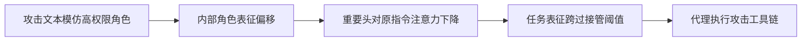

# 提示词注入精选论文精读索引与实验对比

## 推荐阅读顺序

1. [RoleConfusion](/academic/note/?id=n15)：先理解“为什么低权限文本会被当成高权限角色”。
2. [AttentionTracker](/academic/note/?id=n03)：再看攻击如何对应注意力从原指令迁移。
3. [AgentDojo](/academic/note/?id=n02)：理解代理安全的任务、工具、攻击与效用如何测量。
4. [AdaptiveAttackAgent](/academic/note/?id=n01)：建立正确的防御评测观，拒绝静态攻击上的虚假安全感。
5. [StruQ](/academic/note/?id=n17)：看模型级结构化边界能解决什么、留下什么。
6. [CaMeL](/academic/note/?id=n04)：看系统级控制流、数据流和 capability 如何把模型移出安全边界。
7. [IPIArena](/academic/note/?id=n11)：最后用真实红队数据检查前面机制能否解释开放世界攻击。

## 七篇论文各回答什么

| 论文 | 核心问题 | 最有辨识度的数据 | 我的判断 |
|---|---|---|---|
| RoleConfusion | 模型内部如何感知角色 | 去风格化使 ASR 平均下降 51 pp | 当前最强统一机理解释 |
| AttentionTracker | 注入时注意力如何变化 | 0.3% 注意力头达到 0.986 AUROC | 好检测信号，因果性仍待验证 |
| AgentDojo | 怎样公平测代理注入 | GPT-4o utility 69%，ASR 47.69% | utility 与安全必须联合报告 |
| AdaptiveAttackAgent | 防御是否经得起已知机制攻击 | 八种防御均被打到 ASR >50% | 自适应评测应成为硬标准 |
| StruQ | 模型能否学会 prompt/data 边界 | 普通攻击 0%，GCG 仍 56–58% | 修复语法边界，未解决语义竞争 |
| CaMeL | 能否在模型外保证安全 | Gemini 2.5 Pro 攻击 163→0，utility -32 pp | 安全方向正确，工程与效用成本真实 |
| IPIArena | 真实红队下有无免疫模型 | 27.2 万尝试，所有 13 模型被攻破 | 最强现实证据，非纯模型排行榜 |

## 跨论文实验数据的共同信号

### 1. “更强”不是单调更安全

- AgentDojo 中 GPT-4o 的高工具能力伴随 47.69% 定向 ASR。
- IPI Arena 中 GPQA 与 ASR 相关不显著（$r=-0.31,p=0.299$）。
- CaMeL 中同一架构对 o4-mini 几乎不损效用，对 Gemini 2.5 Pro 却损失 32 pp。

值得建立二维能力分解：

$$
\text{Observed Risk}
\approx
\text{Susceptibility}
\times
\text{Execution Capability}
\times
\text{Granted Authority}
$$

低能力模型可能不执行攻击，也不完成正常任务；真正危险的是既易受影响、又能可靠完成高权限工具链的模型。

### 2. 传统攻击归零不代表边界成立

- AgentDojo 中简单 ignore 攻击约 5%，Important Message 可到 57.7%。
- StruQ 对 completion 攻击为 0%，GCG 仍约 56–58%。
- RoleConfusion 中标准工具注入约 0–2%，CoT Forgery 升到 56–70%。

这三篇共同说明，防御常学会了旧攻击的表面分布，而非可信来源规则。

### 3. 内部机制证据正在汇合

- RoleConfusion：文本风格压过 role tag，形成权限误判。
- AttentionTracker：对原指令的注意力下降，焦点移向注入指令。
- IPI Arena：Fake CoT、Fake Syntax、Fake User/Assistant 在真实红队中高效。

可检验的统一链路是：

目前 B→C→D 的因果方向尚未被同一套实验完整证明，这是最值得做的机制研究。

## 最值得继续做的五组实验

### 实验 A：Role Probe × Attention Tracker 联合测量

在同一模型、同一攻击轨迹上逐层测 Userness/CoTness 与 Focus Score，并做 activation patching。目标是判断角色误判先发生，还是注意力迁移先发生。

### 实验 B：用 CoT Forgery 攻击 StruQ

StruQ 主评测偏 delimiter/completion，RoleConfusion 偏文体冒充。若保留 token 边界仍被 CoT 风格打穿，说明结构化训练没有建立语义权限；若稳健，则可研究它如何改变角色表征。

### 实验 C：对 CaMeL 做系统级自适应攻击

不要继续优化“忽略指令”，而应攻击可信计算基：模糊 user intent、schema confusion、parser differential、工具内部二次调用、capability 洗白、策略遗漏和侧信道。

### 实验 D：安全-效用-成本三维 Pareto

统一在 AgentDojo/IPI Arena 子集上报告：正常 utility、攻击下 utility、ASR、P50/P95 token/延迟、人工确认次数。CaMeL、StruQ、检测器和 tool filter 才能公平比较。

### 实验 E：重复尝试风险

IPI Arena 的累计成功近似线性。报告单次 ASR $p$ 之外，应报告预算 $k$ 下至少成功一次的概率：

$$
P_{\ge 1}=1-(1-p)^k
$$

并实测攻击并非独立同分布时的 hazard curve，尤其关注不可逆工具动作。

## 总结判断

> [!abstract]
> 这七篇连起来给出的答案是：提示词注入首先是模型内部的角色与任务归因错误，然后被注意力竞争和代理执行能力放大；静态过滤与提示工程能清理旧攻击，却经不起目标化适应；最可靠的方向不是等待模型永不犯错，而是将自然语言规划置于可审计的控制流、信息流和最小权限执行器之内。

## 图谱关联

- 总览：[WIG知识图谱索引](/academic/note/?id=n19)、[近两年提示词注入攻击机理研究综述](/academic/note/?id=n26)
- 长程/工作区扩展：[ClawTrojan阅读笔记](/academic/note/?id=n05)、[OpenClaw工作区链式注入研究综述](/academic/note/?id=n13)