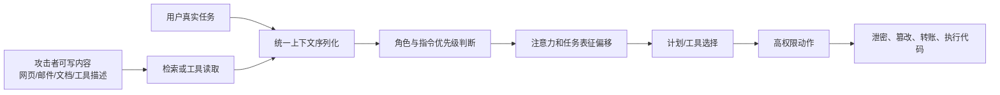

# 近两年提示词注入攻击机理研究综述

> [!tip] 精读入口
> 最值得细读的七篇论文、关键实验复盘与跨论文深挖方向见：[提示词注入精选精读索引](/academic/note/?id=n24)。

> [!abstract] 核心结论
> 提示词注入并不只是“模型不听话”，而是一个跨层安全问题：LLM 把来自系统、用户、网页、工具和记忆的内容压进同一条 token 流；模型又倾向于根据文本的**语气和形态**推断“谁在发号施令”，而不是可靠地服从外部标注的信任等级。一旦这种角色混淆把攻击文本当成高权限指令，注意力会从原任务转向注入目标；代理框架再把这一认知偏移放大为工具调用、数据外泄或不可逆操作。近两年的最强证据因此共同指向：**单靠更强的系统提示、关键词过滤或另一个 LLM 做裁判，无法形成稳定安全边界；可信控制流、信息流约束、最小权限与执行前授权才是更可靠的落点。**

## 1. 调研范围与筛选标准

本报告以 **2024-08-16 至 2026-08-16** 为主要时间窗，聚焦直接提示词注入（DPI）与间接提示词注入（IPI）的攻击机理、代理放大机制、评测方法和可解释证据。少量 2024 年上半年的工作仅作为理论前史，因为它们直接奠定了近两年的结构化查询和指令层级路线。

纳入优先级如下：

1. 已在 ACL、NAACL、EMNLP、NeurIPS、ICLR、USENIX Security、IEEE S&P、ACM CCS、NDSS 等会议发表；
2. 被后续研究反复复用的基准或防御，如 AgentDojo、InjecAgent、ASB、StruQ、SecAlign；
3. 虽仍为预印本，但提供了难以替代的机理证据，如角色探针、因果干预或大规模公开红队数据；
4. 明确研究“提示词注入”，而不是仅研究越狱、训练数据投毒或一般幻觉。

> [!note] 关于“应用量高”
> 这里不把社交媒体热度当作学术影响力，而以**被后续论文复用为基准、被多种防御用于对照、开放代码/数据、进入真实代理或公开红队评测**作为应用信号。AgentDojo、InjecAgent、ASB、StruQ 和 SecAlign 在这一意义上最成熟。

## 2. 先把概念说清楚：注入不是越狱

| 问题 | 攻击者想改变什么 | 典型输入位置 | 主要风险 |
|---|---|---|---|
| 提示词注入 | 应用原本要执行的任务或控制流 | 用户输入、检索文档、网页、邮件、工具输出、记忆 | 越权调用工具、泄密、篡改、支付或代码执行 |
| 越狱 | 模型的安全政策与拒答边界 | 通常是用户直接对话 | 生成被政策禁止的内容 |
| 系统提示泄露 | 隐藏指令或应用逻辑的机密性 | 用户输入或间接内容 | 商业逻辑、密钥线索、策略暴露 |
| RAG 投毒 | 检索知识与回答事实 | 外部知识库 | 错误事实、偏置与持续性操纵 |

两者会重叠，但机理重点不同。越狱常问“如何让模型违反安全对齐”，提示词注入则问：“为什么低信任数据能改变高信任程序的行为？”后者更接近经典安全中的**混淆代理（confused deputy）**与代码/数据边界破坏。

## 3. 一个统一的攻击模型

令可信任务指令为 $I_t$，不可信外部数据为 $D_u$，攻击载荷为 $a$，序列化器为 $S$，模型与代理策略为 $M$。系统实际执行的是：

$$
y = M\left(S\left(I_t,\,D_u \oplus a\right)\right)
$$

若输出或工具动作 $y$ 满足攻击者目标 $G_a$，同时偏离用户授权集合 $A_u$，则注入成功：

$$
\operatorname{Success}(a)=
\mathbb{1}\left[y\models G_a\right]
\cdot
\mathbb{1}\left[y\notin A_u\right]
$$

这个表达式揭示了真正的问题：对普通程序而言，$I_t$ 是代码，$D_u$ 是数据；但在多数 LLM 应用里，两者最终都变成自然语言 token。分隔符、XML 标签和 role tag 提供了提示，却不天然提供像 CPU 权限环或类型系统那样的强制隔离。

## 4. 四层攻击机理

### 4.1 表示层：信任边界被压平为一条 token 流

早期解释通常停在“模型分不清指令和数据”。近两年的研究把它说得更精确：**应用层的来源标签并不等于模型内部稳定的权限表示**。

- [The Instruction Hierarchy](https://arxiv.org/abs/2404.13208) 把漏洞归因于缺乏稳定的指令特权层级，并用层级化训练让模型忽略冲突的低权限指令。
- [StruQ](https://www.usenix.org/conference/usenixsecurity25/presentation/chen-sizhe) 将查询拆成 prompt 与 data 两个通道，再专门训练模型只执行 prompt 通道里的指令。它在 USENIX Security 2025 正式发表，是“从输入结构修复边界”的代表作。
- [Instructional Segment Embedding](https://arxiv.org/abs/2410.09102) 更进一步，把指令优先级编码进模型的 segment embedding，而非只依赖文本分隔符；其报告的 robust accuracy 平均提升最高约 15.75% 和 18.68%。

这一路线的重要启示是：**role tag 是软标签，不是权限位**。只要模型仍可根据内容覆盖标签含义，应用就不能把聊天模板当成安全隔离。

### 4.2 角色层：模型根据“像谁说的”判断权威

ICML 2026 的 [Prompt Injection as Role Confusion](https://arxiv.org/abs/2603.12277) 给出了目前最直接的统一机理解释。作者设计 role probe 读取模型内部对“谁在说话”的表征，发现：

- 不可信文本若模仿用户命令或模型自身推理的写作形态，会进入与被模仿角色相近的表示空间；
- 模型会把伪造推理误认为自己的思考。其 CoT Forgery 零样本攻击在前沿模型上达到约 60% 成功率，而相应基线接近 0；
- 角色混淆程度可在模型生成第一个 token 之前预测攻击是否成功；
- 同一机制也能解释工具输出中的普通代理劫持：文本虽然位于 `<tool>` 段，却因“听起来像用户命令”而继承了用户角色的权威。

这比“模型偏爱最近一句话”更深一层。位置、长度和措辞会影响攻击，但根因不是简单的 recency bias，而是**来源标签与模型感知角色之间发生了解耦**。

### 4.3 注意力层：从原任务到注入任务的“分心效应”

[Attention Tracker](https://aclanthology.org/2025.findings-naacl.123/)（Findings of NAACL 2025）观察到一类可复现的 distraction effect：若注入成功，一组“重要注意力头”会把焦点从原始指令转移到注入指令。基于原始推理时即可取得的注意力分数，作者构造了无需额外 LLM 调用的检测器，AUROC 相比既有方法最高提升 10 个百分点。

[TopicAttack](https://aclanthology.org/2025.emnlp-main.372/)（EMNLP 2025）则从攻击侧验证了同一现象。它不粗暴插入“忽略之前指令”，而是伪造一段自然的对话过渡，逐渐把话题从原任务迁移到恶意任务：

- 平滑过渡降低注入段在上下文中的突兀度和困惑度；
- 注入指令相对原指令的注意力比值越高，成功概率越高；
- 在多数评测设置中，即使存在若干防御，攻击成功率仍超过 90%。

2026 年预印本 [IterInject](https://arxiv.org/abs/2605.24659) 又提出“中后层注意力阈值”假说：注入表征在中后层跨过某个竞争阈值后，行为会快速转向攻击目标；论文用三类因果干预验证该机制。它在 Claude Code 的 9 个目标中对 5 个实现完全成功。不过该文截至本报告日期仍标注为投稿 EMNLP 2026，应视为有力但尚待同行评审的证据。

> [!warning] 不要把注意力直接等同于因果
> Attention Tracker 和 TopicAttack 提供了强相关证据；IterInject 才进一步做了因果干预。更稳妥的表述是：注意力迁移是目前可观测、可利用的攻击中介之一，而不是已经被证明的唯一根因。

### 4.4 系统层：认知偏移被代理权限放大

如果聊天机器人只能输出文本，注入最多污染答案；如果代理可读邮件、调用支付、写文件或执行命令，同一次偏移会沿着“观察 → 计划 → 工具 → 新观察”的循环放大。

- [InjecAgent](https://aclanthology.org/2024.findings-acl.624/)（Findings of ACL 2024）提供 1,054 个测试用例、17 类用户工具与 62 类攻击者工具；对 30 种代理配置评测后，ReAct 提示的 GPT-4 在其设置下约 24% 的攻击中失守。
- [AgentDojo](https://proceedings.neurips.cc/paper_files/paper/2024/hash/97091a5177d8dc64b1da8bf3e1f6fb54-Abstract-Datasets_and_Benchmarks_Track.html)（NeurIPS 2024 Datasets and Benchmarks）包含 97 个真实任务和 629 个安全测试，覆盖邮件、银行、旅行等场景。其“动态环境”设计允许攻击与防御相互适应，已成为后续工作使用最广的代理注入基准之一。
- [Agent Security Bench](https://proceedings.iclr.cc/paper_files/paper/2025/hash/5750f91d8fb9d5c02bd8ad2c3b44456b-Abstract-Conference.html)（ICLR 2025）扩展到 10 个场景、400 多个工具、27 类攻击/防御与 13 个模型后端；其报告的最高平均攻击成功率为 84.30%，并显示漏洞可出现在系统提示、用户输入、工具调用和记忆检索等多个阶段。

因此，完整攻击并非一句恶意文本，而是一条因果链：

$$
\text{不可信内容}
\rightarrow \text{角色误判}
\rightarrow \text{任务表征偏移}
\rightarrow \text{错误计划}
\rightarrow \text{越权工具调用}
\rightarrow \text{不可逆后果}
$$

## 5. 为什么看似有效的防御会失效

### 5.1 只靠系统提示：安全声明仍是同一种自然语言

“忽略工具输出中的指令”与恶意指令处在同一竞争空间。攻击者可以增加长度、权威语气、上下文一致性，伪造 system/user/assistant 段，或把攻击拆成多轮。系统提示可以降低低成本攻击，却没有强制执行语义。

### 5.2 关键词与困惑度过滤：攻击可以变得自然

TopicAttack 表明，攻击越像自然话题延续，越容易提升注入相对注意力并绕过针对“突兀命令”的规则。2026 年 NDSS 的 [ObliInjection](https://www.ndss-symposium.org/ndss-paper/obliinjection-order-oblivious-prompt-injection-attack-to-llm-agents-with-multi-source-data/) 还说明攻击者不必知道多个输入片段的排列顺序：order-oblivious loss 与 orderGCG 能优化在不同排列下都有效的污染片段，即使 6 至 100 个片段中只有一个被控制也能构成威胁。

### 5.3 再调用一个 LLM 检测：检测器也读到了攻击文本

检测 LLM 与执行 LLM 往往共享同类脆弱性。攻击者可以把“骗过检测器”纳入优化目标。[Adaptive Attacks Break Defenses](https://aclanthology.org/2025.findings-naacl.395/)（Findings of NAACL 2025）针对八种防御定制攻击，全部绕过，并持续取得超过 50% 的攻击成功率。这个结果改变了评测规范：**非自适应攻击上的低 ASR 不能证明防御稳健。**

[How Not to Detect Prompt Injections with an LLM](https://arxiv.org/abs/2507.05630) 也专门批评把目标模型的易受注入特性反过来当检测机制的做法。检测不是没有价值，而是必须假设检测器会被针对，并报告误报、漏报、分布外与自适应结果。

### 5.4 静态攻击集：很快被训练集记忆或被防御过拟合

[AGENTVIGIL](https://aclanthology.org/2025.findings-emnlp.1258/)（Findings of EMNLP 2025）用蒙特卡洛树搜索选择和变异攻击种子，在 AgentDojo 与 VWA-adv 上对 o3-mini 和 GPT-4o 分别取得 71% 与 70% 成功率，接近手工基线的两倍。它说明注入研究已从“写一个巧妙 payload”走向自动化、反馈驱动的黑盒优化。

2026 年的 [大规模公开红队竞赛](https://arxiv.org/abs/2603.15714) 更接近真实攻击分布：464 名参与者对 13 个前沿模型提交约 27.2 万次攻击，在 41 个工具调用、编码和计算机操作场景中得到 8,648 次成功攻击。所有模型均被攻破，模型级成功率约 0.5% 至 8.5%；通用策略可跨越 41 个行为中的 21 个，而且模型能力与鲁棒性相关性很弱。低百分比也不能被误读为风险很低，因为在线攻击者可以重复尝试，且成功动作可能不可逆并被最终回复掩盖。

## 6. 代表性论文对照表

| 工作 | 发表状态 | 主要贡献 | 对机理理解的价值 | 局限 |
|---|---|---|---|---|
| InjecAgent | Findings of ACL 2024 | 工具代理 IPI 基准 | 证明外部内容可跨工具链劫持代理 | 模拟工具与早期模型为主 |
| AgentDojo | NeurIPS 2024 D&B | 动态攻击/防御环境 | 把安全、任务效用和自适应攻击放在同一环境 | 场景仍是受控模拟 |
| Attention Tracker | Findings of NAACL 2025 | 发现注意力“分心效应” | 提供内部可观测机制与轻量检测信号 | 注意力证据不自动等于完整因果解释 |
| ASB | ICLR 2025 | 多阶段代理安全基准 | 显示攻击面贯穿 prompt、工具与记忆 | 不同攻击的现实性并不完全一致 |
| DataSentinel | IEEE S&P 2025 | minimax 自适应检测训练 | 把检测建模为攻击者与防御者的博弈 | 仍依赖训练分布与可用模型内部访问 |
| Adaptive Attacks | Findings of NAACL 2025 | 自适应绕过八种防御 | 证明静态评测会高估安全性 | 自适应预算与真实攻击成本需单独比较 |
| Task Shield | ACL 2025 Long | 逐步验证动作是否服务用户目标 | 将问题从“识别坏文本”改为“验证任务对齐” | 依赖额外 LLM 调用；主要在 GPT/AgentDojo 验证 |
| StruQ | USENIX Security 2025 | prompt/data 结构化双通道 | 直接修补代码/数据混合 | 需要专门训练模型，且仍需面对新型自适应攻击 |
| SecAlign | ACM CCS 2025 | 用偏好优化选择安全输出 | 让模型在冲突任务中偏好可信指令 | 后续研究表明单一训练防御仍可被定制攻击绕过 |
| TopicAttack | EMNLP 2025 Main | 平滑话题迁移攻击 | 连接困惑度、注意力比值与攻击成功 | 机理分析集中于特定模型/任务设置 |
| AGENTVIGIL | Findings of EMNLP 2025 | MCTS 黑盒自动红队 | 展示攻击策略可搜索、可迁移 | 成本与搜索预算影响横向比较 |
| InstructDetector | Findings of EMNLP 2025 | 识别外部内容中的指令 | 把“数据中出现可执行意图”作为检测对象 | 识别到指令不等于判断其是否被授权 |
| Role Confusion | ICML 2026 | 角色探针与 CoT Forgery | 给出“像某角色就继承其权威”的统一解释 | 新工作，仍需跨架构、跨语言重复验证 |
| ACE | NDSS 2026 | 抽象计划、具体化、执行三阶段隔离 | 以静态分析和 capability barrier 约束规划与执行 | 工程复杂度与任务覆盖需进一步评估 |
| ObliInjection | NDSS 2026 | 多源、未知顺序的优化攻击 | 说明少量污染可在长上下文中稳定竞争 | 白盒/优化假设与部署环境有距离 |
| ToolHijacker | NDSS 2026 | 恶意工具文档劫持工具选择 | 暴露“工具说明也是不可信指令面” | 聚焦工具检索/选择阶段 |
| IPI Arena | 2026 预印本/公开竞赛 | 27.2 万次真实红队尝试 | 证明所有前沿模型均可受攻击且攻击可隐蔽 | 各模型外部安全栈不同，百分比不宜作纯模型排名 |
| IterInject | 2026 预印本 | 反馈迭代攻击与因果干预 | 提出中后层注意力阈值机制 | 尚未完成同行评审 |

## 7. 防御路线：从“劝模型”走向“约束系统”

### 7.1 模型训练层

- **指令层级训练**：明确 system、developer、user、tool/data 的优先级。
- **结构化查询训练**：StruQ 让数据通道内的命令不可执行。
- **偏好优化**：SecAlign 构造安全/不安全输出对，让模型偏好继续完成原任务。
- **对抗博弈训练**：DataSentinel 把自适应攻击放入 minimax 训练循环。

优点是可降低基础脆弱性；缺点是无法给闭源模型外挂，且再训练通常提供统计鲁棒性，不等于系统级证明。

### 7.2 推理与检测层

- **来源显著化**：Spotlighting 对不可信数据做持续可识别变换。
- **注意力检测**：Attention Tracker、NDSS 2026 的 [Rennervate](https://www.ndss-symposium.org/ndss-paper/attention-is-all-you-need-to-defend-against-indirect-prompt-injection-attacks-in-llms/) 从内部注意力特征定位注入 token。
- **指令检测**：[InstructDetector](https://aclanthology.org/2025.findings-emnlp.1060/) 同时利用语言和行为状态特征；原论文报告域内 99.60%、域外 96.90% 检测准确率，并把 BIPIA 上 ASR 降至 0.03%。
- **任务对齐验证**：Task Shield 检查每个识别出的指令和工具调用是否推进用户目标；在 GPT-4o/AgentDojo 设置中报告 2.07% ASR 与 69.79% 任务效用。

这类方法部署灵活，但最容易遭遇“检测器本身也被注入”和误报损伤效用的问题。数字必须连同攻击适应性、模型、任务和阈值一起阅读。

### 7.3 控制流与信息流层

- [CaMeL](https://arxiv.org/abs/2503.18813) 从可信用户查询中显式提取控制流和数据流，不允许后来读到的不可信文本改变程序流；再用 capability 限制私密数据流向未授权目的地。它在 AgentDojo 上以可证明安全方式完成约 67% 任务。
- [ACE](https://www.ndss-symposium.org/ndss-paper/ace-a-security-architecture-for-llm-integrated-app-systems/) 先仅依赖可信信息生成抽象计划，再把计划映射到具体应用，并用静态分析验证信息流约束；执行时隔离应用数据与 capability。
- Task Shield 可视为较轻量的语义控制流验证，但其判定器仍是概率模型。

这一路线最接近传统系统安全：不要求模型永远正确，而是假设模型可能被操纵，并在外部建立不可绕过的执行边界。

### 7.4 权限与执行层

一个现实代理至少应具备：

1. 只读与写入工具分离；
2. 高风险工具使用短期、窄作用域 capability；
3. 目标、参数、收件人、金额、文件路径等敏感字段在执行前逐项授权；
4. 从不可信内容派生的值带 taint/provenance 标签；
5. 外发、删除、支付、安装、执行代码等不可逆动作要求确定性策略或人工确认；
6. 计划与执行绑定，禁止工具输出临时新增未授权目标；
7. 记录真实工具副作用，而不只检查模型最终回复。

## 8. 对现有证据的批判性判断

### 8.1 目前可以相当有把握地说

1. 指令与数据共享自然语言表示是根本攻击面，role tag 和分隔符只能缓解，不能自动形成强隔离。
2. 注入成功与模型内部角色表征、注意力迁移存在稳定关系；角色混淆是目前解释力最强的统一假说。
3. 代理的高权限工具将模型错误从内容完整性问题升级为系统完整性与机密性问题。
4. 自适应攻击显著强于固定模板，因此防御必须在攻击者知道防御的条件下评测。
5. 模型能力更强不保证更抗注入；更强的指令跟随和工具使用能力有时反而提高可利用性。

### 8.2 仍不能下定论

1. **不存在已被证明对开放世界自然语言输入完全免疫的通用模型级防御。**
2. 注意力迁移是唯一根因的说法证据不足；残差流、MLP、位置、上下文压缩和解码策略可能共同参与。
3. 基准 ASR 不能直接换算成真实世界事故概率。攻击者访问、尝试次数、工具权限与用户确认都会改变风险。
4. 许多防御的高准确率来自有限数据集；面对多语言、隐写、图像、音频、长上下文、记忆和多代理传播时，外推能力仍不足。
5. “可证明安全”通常依赖明确假设，例如可信规划输入、完整的 sink 声明、正确的策略和不可绕过的执行器。证明保护的是模型外系统，不是任意自然语言行为。

## 9. 研究趋势与值得继续追的方向

### 9.1 从字符串攻击转向语义与表示攻击

TopicAttack、Role Confusion 与 IterInject 说明，未来攻击不会依赖显眼的“ignore previous instructions”，而会优化话题连贯性、角色相似度、注意力竞争和模型特定反馈。基于关键词的防御会越来越像拦截已知恶意软件签名。

### 9.2 从单轮文本转向多源、多模态、多代理传播

ObliInjection 研究多源未知顺序，ToolHijacker 攻击工具描述，IPI Arena 覆盖编码与计算机操作。接下来的关键问题是：注入如何跨 RAG、长期记忆、MCP/工具生态、agent-to-agent 消息和多模态感知持续传播。

### 9.3 从输出安全转向“上下文到执行”的完整性

单看最终回答可能漏掉已经发生的恶意工具调用。更合理的评测单位是完整轨迹：读取了什么、产生了什么计划、调用了哪些工具、哪些参数来自不可信数据、产生了哪些外部副作用，以及最终回复是否掩盖了攻击。

### 9.4 从平均 ASR 转向风险曲线

实际部署更关心：在 $k$ 次攻击尝试下至少成功一次的概率、攻击成本、误报导致的任务损失、不可逆动作价值和攻击可迁移性。若单次成功率为 $p$，在近似独立的 $k$ 次尝试下至少成功一次的概率为：

$$
P_{\geq 1}=1-(1-p)^k
$$

即使 $p=1\%$，尝试 100 次后该概率也约为 63.4%。这正是公开竞赛中“看起来不高的模型级 ASR”仍不可轻视的原因。

## 10. 面向实践的结论

> [!tip] 最重要的设计原则
> **把 LLM 当成可能被不可信文本操纵的规划器，而不是安全决策点。** 模型可以提出动作，但授权、数据流检查和最终执行应由更小、更确定、可审计的组件完成。

可采用的防御优先级：

| 优先级 | 措施 | 原因 |
|---|---|---|
| P0 | 最小权限、敏感动作确认、确定性执行策略 | 即使模型失守也限制后果 |
| P0 | 标记并追踪不可信数据来源，禁止其直接控制 sink 参数 | 阻断数据到控制流的升级 |
| P1 | 可信输入生成计划，执行阶段绑定计划与 capability | 接近 CaMeL/ACE 的系统安全思路 |
| P1 | 在真实工具轨迹上做自适应红队评测 | 避免只测静态 prompt 和最终回复 |
| P2 | 指令层级/StruQ/SecAlign 类模型训练 | 降低基础攻击面，但不单独承担安全边界 |
| P2 | 检测器、注意力信号、内容清洗 | 作为纵深防御与告警，不作为唯一闸门 |

## 11. 推荐阅读顺序

1. **建立问题感**：[InjecAgent](https://aclanthology.org/2024.findings-acl.624/) → [AgentDojo](https://proceedings.neurips.cc/paper_files/paper/2024/hash/97091a5177d8dc64b1da8bf3e1f6fb54-Abstract-Datasets_and_Benchmarks_Track.html)
2. **理解模型内部机制**：[Attention Tracker](https://aclanthology.org/2025.findings-naacl.123/) → [TopicAttack](https://aclanthology.org/2025.emnlp-main.372/) → [Role Confusion](https://arxiv.org/abs/2603.12277)
3. **理解为什么旧防御失效**：[Adaptive Attacks Break Defenses](https://aclanthology.org/2025.findings-naacl.395/) → [AGENTVIGIL](https://aclanthology.org/2025.findings-emnlp.1258/)
4. **比较模型级防御**：[StruQ](https://www.usenix.org/conference/usenixsecurity25/presentation/chen-sizhe) → [SecAlign](https://sizhe-chen.github.io/SecAlign-Website/) → [DataSentinel](https://sp2025.ieee-security.org/program.html)
5. **转向系统级安全**：[Task Shield](https://aclanthology.org/2025.acl-long.1435/) → [CaMeL](https://arxiv.org/abs/2503.18813) → [ACE](https://www.ndss-symposium.org/ndss-paper/ace-a-security-architecture-for-llm-integrated-app-systems/)
6. **看最新真实强度**：[IPI Arena 公开竞赛](https://arxiv.org/abs/2603.15714) → [ObliInjection](https://www.ndss-symposium.org/ndss-paper/obliinjection-order-oblivious-prompt-injection-attack-to-llm-agents-with-multi-source-data/) → [IterInject](https://arxiv.org/abs/2605.24659)

## 12. 主要参考文献

### 同行评审与正式发表

- Zhan et al. [InjecAgent: Benchmarking Indirect Prompt Injections in Tool-Integrated Large Language Model Agents](https://aclanthology.org/2024.findings-acl.624/). Findings of ACL, 2024.
- Debenedetti et al. [AgentDojo: A Dynamic Environment to Evaluate Prompt Injection Attacks and Defenses for LLM Agents](https://proceedings.neurips.cc/paper_files/paper/2024/hash/97091a5177d8dc64b1da8bf3e1f6fb54-Abstract-Datasets_and_Benchmarks_Track.html). NeurIPS Datasets and Benchmarks, 2024.
- Zhang et al. [Agent Security Bench: Formalizing and Benchmarking Attacks and Defenses in LLM-based Agents](https://proceedings.iclr.cc/paper_files/paper/2025/hash/5750f91d8fb9d5c02bd8ad2c3b44456b-Abstract-Conference.html). ICLR, 2025.
- Hung et al. [Attention Tracker: Detecting Prompt Injection Attacks in LLMs](https://aclanthology.org/2025.findings-naacl.123/). Findings of NAACL, 2025.
- Zhan et al. [Adaptive Attacks Break Defenses Against Indirect Prompt Injection Attacks on LLM Agents](https://aclanthology.org/2025.findings-naacl.395/). Findings of NAACL, 2025.
- Liu et al. [DataSentinel: A Game-Theoretic Detection of Prompt Injection Attacks](https://sp2025.ieee-security.org/program.html). IEEE Symposium on Security and Privacy, 2025.
- Jia et al. [The Task Shield: Enforcing Task Alignment to Defend Against Indirect Prompt Injection in LLM Agents](https://aclanthology.org/2025.acl-long.1435/). ACL, 2025.
- Chen et al. [StruQ: Defending Against Prompt Injection with Structured Queries](https://www.usenix.org/conference/usenixsecurity25/presentation/chen-sizhe). USENIX Security, 2025.
- Chen et al. [SecAlign: Defending Against Prompt Injection with Preference Optimization](https://sizhe-chen.github.io/SecAlign-Website/). ACM CCS, 2025.
- Chen et al. [TopicAttack: An Indirect Prompt Injection Attack via Topic Transition](https://aclanthology.org/2025.emnlp-main.372/). EMNLP, 2025.
- Wang et al. [AGENTVIGIL: Automatic Black-Box Red-teaming for Indirect Prompt Injection against LLM Agents](https://aclanthology.org/2025.findings-emnlp.1258/). Findings of EMNLP, 2025.
- Wen et al. [Defending against Indirect Prompt Injection by Instruction Detection](https://aclanthology.org/2025.findings-emnlp.1060/). Findings of EMNLP, 2025.
- Ye et al. [Prompt Injection as Role Confusion](https://arxiv.org/abs/2603.12277). ICML, 2026.
- Li et al. [ACE: A Security Architecture for LLM-Integrated App Systems](https://www.ndss-symposium.org/ndss-paper/ace-a-security-architecture-for-llm-integrated-app-systems/). NDSS, 2026.
- Wang et al. [ObliInjection: Order-Oblivious Prompt Injection Attack to LLM Agents with Multi-source Data](https://www.ndss-symposium.org/ndss-paper/obliinjection-order-oblivious-prompt-injection-attack-to-llm-agents-with-multi-source-data/). NDSS, 2026.
- Shi et al. [Prompt Injection Attack to Tool Selection in LLM Agents](https://www.ndss-symposium.org/ndss-paper/prompt-injection-attack-to-tool-selection-in-llm-agents/). NDSS, 2026.
- Zhong et al. [Attention is All You Need to Defend Against Indirect Prompt Injection Attacks in LLMs](https://www.ndss-symposium.org/ndss-paper/attention-is-all-you-need-to-defend-against-indirect-prompt-injection-attacks-in-llms/). NDSS, 2026.

### 高影响预印本与前史

- Wallace et al. [The Instruction Hierarchy: Training LLMs to Prioritize Privileged Instructions](https://arxiv.org/abs/2404.13208). arXiv, 2024.
- Hines et al. [Defending Against Indirect Prompt Injection Attacks With Spotlighting](https://arxiv.org/abs/2403.14720). arXiv, 2024.
- Wu et al. [Instructional Segment Embedding: Improving LLM Safety with Instruction Hierarchy](https://arxiv.org/abs/2410.09102). arXiv, 2024.
- Debenedetti et al. [Defeating Prompt Injections by Design](https://arxiv.org/abs/2503.18813). arXiv, 2025.
- Dziemian et al. [How Vulnerable Are AI Agents to Indirect Prompt Injections? Insights from a Large-Scale Public Competition](https://arxiv.org/abs/2603.15714). arXiv, 2026.
- Chen et al. [IterInject: Indirect Prompt Injection Against LLM Agents via Feedback-Guided Iterative Optimization](https://arxiv.org/abs/2605.24659). arXiv, 2026.

---

*调研与核对日期：2026-08-16。会议归属、论文状态与实验数字以论文原文和会议官方页面为准；预印本结论已在正文中单独标注。*

## 图谱关联

- 导航枢纽：[WIG知识图谱索引](/academic/note/?id=n19)、[提示词注入精选精读索引](/academic/note/?id=n24)
- 工作区与持久化专题：[OpenClaw工作区链式注入研究综述](/academic/note/?id=n13)、[ClawTrojan阅读笔记](/academic/note/?id=n05)
- 系统与 Harness 专题：[Harness白盒攻击与上下文压缩攻击前沿调研](/academic/note/?id=n09)、[Setup Complete Now You Are Compromised](/academic/note/?id=n16)